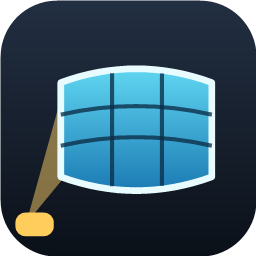
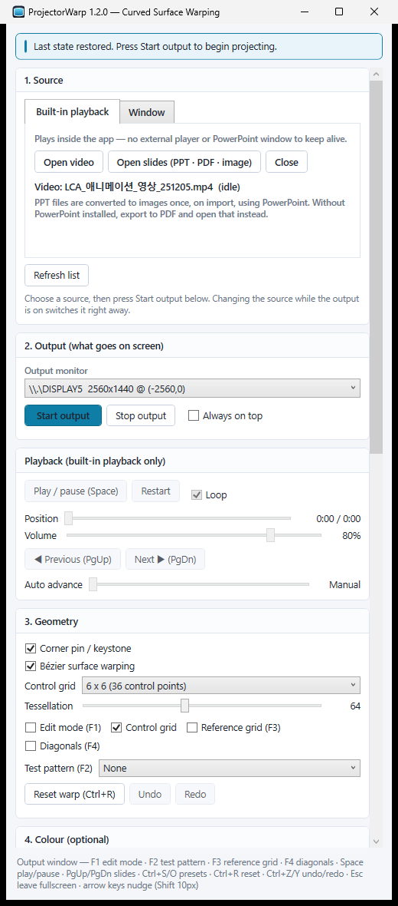

# ProjectorWarp

**Project onto curved walls, pillars and arches — and keep straight lines straight.**

Projecting onto a flat screen is easy. Projecting onto a curved wall, a pillar or an arch is not —
straight lines bow, text smears at the edges, and no amount of moving the projector fixes it.

**ProjectorWarp** is a free Windows utility that fixes it in software. It inverse-warps the image in
real time so straight lines land straight on the surface: corner-pin keystone, a Bézier surface mesh
you drag into shape, polygon masking, colour correction, and edge blending for multi-projector setups.

Everything stays on the GPU. Decoding, capture and warping share a single Direct3D 11 device, so 4K
video plays without dropping frames.

> **The interface is in Korean.** Button names below are given as they appear, with an English gloss.

---

## Install

Download `ProjectorWarp.exe` from the [**latest release**](https://github.com/MinaryHub/ProjectorWarp/releases/latest)
and run it. It is a single self-contained executable — no runtime to install, no installer, nothing
written to the registry unless you turn on start-at-logon yourself.

### Requirements

| | |
|---|---|
| OS | Windows 10 1903 (build 18362) or later · Windows 11 recommended |
| Graphics | A Direct3D 11 capable GPU (falls back to the WARP software renderer) |
| Architecture | x64 |

---

## What it does

**Sources** — pick one of two:

- **내장 재생** *(built-in playback)* — play video files, or PPT / PDF / image slides, directly in the
  app. No external player or PowerPoint window to keep alive.
- **창** *(window capture)* — capture any running window through `Windows.Graphics.Capture`.

**Geometry correction**, in three layers you can combine:

1. **Corner pin / keystone** — drag the four corners; a 3×3 homography is solved from them.
2. **Bézier surface** — drag a 3×3 to 6×6 grid of control points to follow the curve of the wall.
   Tessellation runs from 16×16 to 128×128.
3. **Masking** — cut spill light with polygon black masks.

**Colour and blending** — brightness, contrast and gamma, plus per-edge blending for multi-projector
setups.

**Alignment tools** — grid, checkerboard, concentric rings and colour bars as test patterns, with a
reference grid and diagonals, all while you keep dragging control points on the live output.

**Presets and auto-start** — save the alignment together with the source and output monitor. The last
state is saved automatically when you quit, and the app can start at logon and begin projecting on
its own.

 

---

## Getting started

1. **Choose a source** — open a file under **내장 재생**, or select a window under **창**.
2. **Choose the output monitor, then press 출력 시작** *(start output)*. A borderless fullscreen window
   opens on that monitor and the selected source starts with it. Whether anything is on screen is
   decided by **출력 시작** / **출력 중지** *(stop output)* alone.
3. **Press `F1`** on the output window to enter edit mode and drag the control points into shape.
   `F2` puts up a test pattern, which makes alignment much easier.
4. **Press `Ctrl+S`** to save. The alignment comes back the next time you start.

### Output window shortcuts

| Key | Action | Key | Action |
|---|---|---|---|
| `F1` | Edit mode | `Space` | Play / pause |
| `F2` | Test pattern | `PgUp` `PgDn` | Previous / next slide |
| `F3` | Reference grid | `Ctrl+S` `Ctrl+O` | Save / open preset |
| `F4` | Diagonals | `Ctrl+R` | Reset warp |
| `Esc` | Leave fullscreen | `Ctrl+Z` `Ctrl+Y` | Undo / redo |

Arrow keys nudge the selected control point by one pixel, `Shift` + arrows by ten.

---

## Updates

The app checks this repository for new releases under **9. 버전 · 업데이트** *(version and updates)*.
There is nothing to configure.

It checks quietly after start-up and speaks up only when a newer version exists. Nothing changes
until you press **설치 후 재시작** *(install and restart)* — it will never restart itself in the
middle of a projection.

---

## Sponsor

ProjectorWarp is free and will stay free. Sponsorship pays for the parts that are invisible until the
night that matters: testing against real projectors and awkward display layouts, chasing Windows
codec and driver quirks, and keeping capture and playback stable through Windows updates.

---

## About this repository

**This repository is for distribution.** The source is kept in a private repository; only the
executable is published here, and the app's updater reads the latest release from it.

Bug reports and requests are welcome in [Issues](https://github.com/MinaryHub/ProjectorWarp/issues).
What helps most:

- the ProjectorWarp version (in the title bar, or under **9. 버전 · 업데이트**)
- your Windows version and GPU
- the source you used — built-in playback or window capture, and for video, the container and codec
- whatever the status bar at the top of the control panel said
